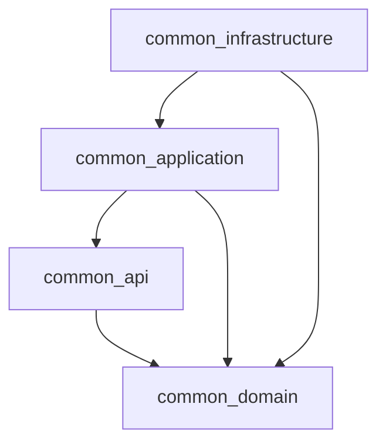

# Common Libraries

The `common-libraries` Maven aggregator groups shared code used across
platform services. Its four child modules separate domain concepts, external
data contracts, application-facing use-case contracts, and infrastructure
dependencies.

## Module map

```text
common-libraries
├── common-domain          Domain entities, value types, and domain events
├── common-api             Commands and response DTOs
├── common-application     Use-case interfaces
└── common-infrastructure  Shared infrastructure dependency module
```

| Module | Responsibility | Current scope |
|---|---|---|
| [`common-domain`](../common-domain/docs/README.md) | Business concepts and domain behavior | User, authentication provider, role, permission, token, and event types |
| [`common-api`](../common-api/docs/README.md) | Data shapes passed into and out of operations | Login/OAuth/user-management commands and response records |
| [`common-application`](../common-application/docs/README.md) | Application use-case contracts | Reactive interfaces for login, OAuth login, user creation, and role assignment |
| [`common-infrastructure`](../common-infrastructure/docs/README.md) | Shared technology dependencies for infrastructure | Dependency declarations; it currently contains no reusable adapters |

## Dependency direction

The module dependencies declared in the Maven POMs are:



More precisely, `common-api` and `common-application` both depend on
`common-domain`; `common-application` also depends on `common-api`.
`common-infrastructure` depends on the domain and application modules and
declares Spring, reactive data, Kafka, Redis, and logging dependencies.

The domain module does not depend on Spring, persistence, messaging, or API
frameworks. This keeps the core types usable without loading service
infrastructure. API contracts currently refer to selected domain types
(including auth provider and user status), so they are not yet wholly
independent of the domain model.

## How to use the modules

- Put stable business concepts and rules in `common-domain`.
- Put request/command and response shapes in `common-api`.
- Put use-case interfaces in `common-application`; implement them in the
  owning service.
- Put reusable framework adapters/configuration in
  `common-infrastructure` only when they have a concrete shared use. Avoid
  moving service-specific persistence or integration behavior here merely
  because it uses an infrastructure technology.

## Current implementation boundary

The current auth service contains concrete use-case implementations and
technology adapters, including R2DBC repositories, JWT handling, OAuth
provider adapters, and Kafka event publishers. `common-infrastructure` is
included as a dependency but currently contains only an IntelliJ-generated
sample `Main` class; the declared starters do not by themselves constitute
implemented shared adapters.

## Build

From the repository root:

```shell
mvn -pl common-libraries -am verify
```

## Module guides

- [Domain model](../common-domain/docs/README.md)
- [API contracts](../common-api/docs/README.md)
- [Application contracts](../common-application/docs/README.md)
- [Common infrastructure](../common-infrastructure/docs/README.md)
